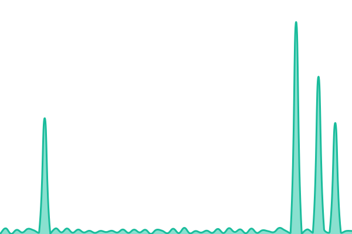

# [📈 Live Status](https://canonical.github.io/ubuntu-engineering-upptime): <!--live status--> **🟧 Partial outage**

This repository contains the open-source uptime monitor and status page for [Canonical](https://canonical.com), powered by [Upptime](https://github.com/upptime/upptime).

With [Upptime](https://upptime.js.org), you can get your own unlimited and free uptime monitor and status page, powered entirely by a GitHub repository. We use [Issues](https://github.com/canonical/ubuntu-engineering-upptime/issues) as incident reports, [Actions](https://github.com/canonical/ubuntu-engineering-upptime/actions) as uptime monitors, and [Pages](https://canonical.github.io/ubuntu-engineering-upptime) for the status page.

<!--start: status pages-->
<!-- This summary is generated by Upptime (https://github.com/upptime/upptime) -->
<!-- Do not edit this manually, your changes will be overwritten -->
<!-- prettier-ignore -->
| URL | Status | History | Response Time | Uptime |
| --- | ------ | ------- | ------------- | ------ |
|  [Appstream](https://appstream.ubuntu.com/) | 🟥 Down | [appstream.yml](https://github.com/canonical/ubuntu-engineering-upptime/commits/HEAD/history/appstream.yml) | 

 0ms
     
 | 

<a href="https://canonical.github.io/ubuntu-engineering-upptime/history/appstream">6.95%</a>
    

|  [Autopkgtest](https://autopkgtest.ubuntu.com/) | 🟥 Down | [autopkgtest.yml](https://github.com/canonical/ubuntu-engineering-upptime/commits/HEAD/history/autopkgtest.yml) | 

 457ms
     
 | 

<a href="https://canonical.github.io/ubuntu-engineering-upptime/history/autopkgtest">0.00%</a>
    

|  [Autopkgtest Staging](https://autopkgtest.staging.ubuntu.com/) | 🟥 Down | [autopkgtest-staging.yml](https://github.com/canonical/ubuntu-engineering-upptime/commits/HEAD/history/autopkgtest-staging.yml) | 

 466ms
     
 | 

<a href="https://canonical.github.io/ubuntu-engineering-upptime/history/autopkgtest-staging">0.00%</a>
    

|  [Connectivity Checker](http://connectivity-check.ubuntu.com) | 🟩 Up | [connectivity-checker.yml](https://github.com/canonical/ubuntu-engineering-upptime/commits/HEAD/history/connectivity-checker.yml) | 

 183ms
     
 | 

<a href="https://canonical.github.io/ubuntu-engineering-upptime/history/connectivity-checker">100.00%</a>
    

|  [Ddebs](https://ddebs.ubuntu.com/) | 🟩 Up | [ddebs.yml](https://github.com/canonical/ubuntu-engineering-upptime/commits/HEAD/history/ddebs.yml) | 

 544ms
     
 | 

<a href="https://canonical.github.io/ubuntu-engineering-upptime/history/ddebs">100.00%</a>
    

|  [DebugInfoD](https://debuginfod.ubuntu.com/health) | 🟩 Up | [debug-info-d.yml](https://github.com/canonical/ubuntu-engineering-upptime/commits/HEAD/history/debug-info-d.yml) | 

 10757ms
     
 | 

<a href="https://canonical.github.io/ubuntu-engineering-upptime/history/debug-info-d">90.17%</a>
    

|  [Errors](https://errors.ubuntu.com/) | 🟩 Up | [errors.yml](https://github.com/canonical/ubuntu-engineering-upptime/commits/HEAD/history/errors.yml) | 

 247ms
     
 | 

<a href="https://canonical.github.io/ubuntu-engineering-upptime/history/errors">100.00%</a>
    

|  [GeoIP](https://geoip.ubuntu.com/) | 🟩 Up | [geo-ip.yml](https://github.com/canonical/ubuntu-engineering-upptime/commits/HEAD/history/geo-ip.yml) | 

 395ms
     
 | 

<a href="https://canonical.github.io/ubuntu-engineering-upptime/history/geo-ip">100.00%</a>
    

|  [Geonames](https://geoname-lookup.ubuntu.com/) | 🟩 Up | [geonames.yml](https://github.com/canonical/ubuntu-engineering-upptime/commits/HEAD/history/geonames.yml) | 

 8871ms
     
 | 

<a href="https://canonical.github.io/ubuntu-engineering-upptime/history/geonames">98.97%</a>
    

|  [Lp retracers](https://launchpad-retracer.ubuntu.com/) | 🟩 Up | [lp-retracers.yml](https://github.com/canonical/ubuntu-engineering-upptime/commits/HEAD/history/lp-retracers.yml) | 

 12583ms
     
 | 

<a href="https://canonical.github.io/ubuntu-engineering-upptime/history/lp-retracers">96.42%</a>
    

|  [Manpages](https://manpages.ubuntu.com/) | 🟩 Up | [manpages.yml](https://github.com/canonical/ubuntu-engineering-upptime/commits/HEAD/history/manpages.yml) | 

 14021ms
     
 | 

<a href="https://canonical.github.io/ubuntu-engineering-upptime/history/manpages">96.42%</a>
    

|  [Merge-o-matic](https://merges.ubuntu.com/) | 🟩 Up | [merge-o-matic.yml](https://github.com/canonical/ubuntu-engineering-upptime/commits/HEAD/history/merge-o-matic.yml) | 

 17954ms
     
 | 

<a href="https://canonical.github.io/ubuntu-engineering-upptime/history/merge-o-matic">96.23%</a>
    

|  [Packages](http://packages.ubuntu.com/) | 🟩 Up | [packages.yml](https://github.com/canonical/ubuntu-engineering-upptime/commits/HEAD/history/packages.yml) | 

 13584ms
     
 | 

<a href="https://canonical.github.io/ubuntu-engineering-upptime/history/packages">97.36%</a>
    

|  [Sponsoring Report](http://sponsoring-reports.ubuntu.com/) | 🟩 Up | [sponsoring-report.yml](https://github.com/canonical/ubuntu-engineering-upptime/commits/HEAD/history/sponsoring-report.yml) | 

 13726ms
     
 | 

<a href="https://canonical.github.io/ubuntu-engineering-upptime/history/sponsoring-report">96.72%</a>
    

|  [SRU Report](https://ubuntu-archive-team.ubuntu.com/pending-sru.html) | 🟩 Up | [sru-report.yml](https://github.com/canonical/ubuntu-engineering-upptime/commits/HEAD/history/sru-report.yml) | 

 8091ms
     
 | 

<a href="https://canonical.github.io/ubuntu-engineering-upptime/history/sru-report">96.29%</a>
    

|  [Static Reports](https://static-reports.ubuntu.com/) | 🟩 Up | [static-reports.yml](https://github.com/canonical/ubuntu-engineering-upptime/commits/HEAD/history/static-reports.yml) | 

 6931ms
     
 | 

<a href="https://canonical.github.io/ubuntu-engineering-upptime/history/static-reports">97.95%</a>
    

|  [Transitions Tracker](https://transitions.ubuntu.com/) | 🟩 Up | [transitions-tracker.yml](https://github.com/canonical/ubuntu-engineering-upptime/commits/HEAD/history/transitions-tracker.yml) | 

 10226ms
     
 | 

<a href="https://canonical.github.io/ubuntu-engineering-upptime/history/transitions-tracker">97.93%</a>
    

|  [Ubuntu Metrics](https://ubuntu-release.kpi.ubuntu.com) | 🟩 Up | [ubuntu-metrics.yml](https://github.com/canonical/ubuntu-engineering-upptime/commits/HEAD/history/ubuntu-metrics.yml) | 

 11494ms
     
 | 

<a href="https://canonical.github.io/ubuntu-engineering-upptime/history/ubuntu-metrics">99.24%</a>
    

|  [Update Excuses](https://ubuntu-archive-team.ubuntu.com/proposed-migration/update_excuses.html) | 🟩 Up | [update-excuses.yml](https://github.com/canonical/ubuntu-engineering-upptime/commits/HEAD/history/update-excuses.yml) | 

 2391ms
     
 | 

<a href="https://canonical.github.io/ubuntu-engineering-upptime/history/update-excuses">54.80%</a>
    

|  [Upki Mirror](https://upki.ubuntu.com/intermediates/manifest.json) | 🟩 Up | [upki-mirror.yml](https://github.com/canonical/ubuntu-engineering-upptime/commits/HEAD/history/upki-mirror.yml) | 

 12408ms
     
 | 

<a href="https://canonical.github.io/ubuntu-engineering-upptime/history/upki-mirror">98.34%</a>
    

|  [Versions](https://people.canonical.com/~platform/desktop/versions/ubuntu-desktop.html) | 🟩 Up | [versions.yml](https://github.com/canonical/ubuntu-engineering-upptime/commits/HEAD/history/versions.yml) | 

 862ms
     
 | 

<a href="https://canonical.github.io/ubuntu-engineering-upptime/history/versions">99.54%</a>
    

<!--end: status pages-->

[**Visit our status website →**](https://canonical.github.io/ubuntu-engineering-upptime)

## 📄 License

- Powered by: [Upptime](https://github.com/upptime/upptime)
- Code: [MIT](./LICENSE) © [Anand Chowdhary](https://anandchowdhary.com), supported by [Pabio](https://pabio.com)
- Data in the `./history` directory: [Open Database License](https://opendatacommons.org/licenses/odbl/1-0/)
